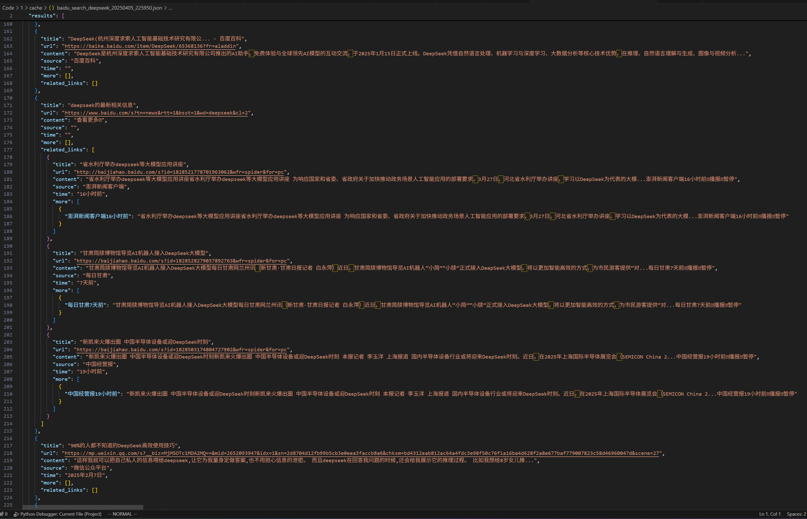

# 实验1 设计一个程序抽取百度的搜索页面信息

## 实验目的

为了实现具有实时联网搜索功能的 DeepSeek 大模型, 让它可以根据时事搜索到的结果进行回答, 需要先获得这些搜索结果的数据. 因此, 阶段 1, 即本实验要实现 Baidu 搜索结果的爬取.

## 实验要求

1. 网址：[https://www.baidu.com](https://www.baidu.com)
2. 需要抽取下列信息：
    网页标题、页面链接、网页摘要

## 实验流程
<!-- 介绍整个实验的操作过程，实验参数设置，实验验证的流程和测试数据 -->

### 页面分析

#### 初步结构分析

通过对 Baidu 搜索结果的页面分析, 得到其页面相关信息大致可拆解为主标题 (及对应的链接), 主内容, 来源, 时间和相关链接 (同包含标题和对应链接, 以及内容, 来源和时间) 这 2 级结构 (未必全都有).

#### 进一步特征分析

根据得到的这个结构, 在对页面进行更深入的分析, 得到:

1. 所有搜索相关结果都在 `<div id="content_left">` 中, 作为所有搜索相关结果的根
2. 遍历根下的所有 `div` 即可得到每一条的搜索主结果, 是每一条搜索结果的根 (通常 `class` 会含有 `c-container` 且含有 `result` , 但无需做判断; 如果下面有结构的 `style` 属性含有 `!important` 则大致可判断为广告 (实验 1 仅测试用, 不开启广告过滤))
3. 主链接的标题和链接大致是对应于 `h3` 标签, 且 `class` 中含有 `title` 或 `t`. 链接对应于其下 `a` 标签的 `herf`, 标题则为其内容
4. 主内容大致对应于 `div` 标签, 其 `class` 会含有 `desc` 或 `text`; 或者对应于 `span` 标签, `class` 会含有 `content-right` 或 `text`
5. 来源大致对应于 `div` 或 `span` 标签, `class` 含有 `showurl` 或 `source-text`; 或对应于 `span` 的 `class` 为 `c-color-gray`
6. 时间大致对应于 `span` 的 `class` 含有 `time` 或为 `c-color-gray2` 或为 `n2n9e2q` (很奇怪, `n2n9e2q` 是什么意思)
7. 子信息在每条搜索结果的根下, 大致与主信息同级, 更精确的, 一般会在 `div` 的 `class` 含有 `sitelink` 下, 为所有子信息的根
8. 子链接的信息大致对应于 `p` 标签的 `class` 含有 `text`, 或对应于 `div` 的 `text` 或 `abs`
9. 子链接的来源大致对应于 `span` 的 `class` 含有 `small`

### 代码编写

#### 实现思路

百度搜索结果爬取程序采用模块化设计, 将网络请求、页面解析、缓存管理和结果存储等功能分离, 提高代码的可维护性和可扩展性. 具体实现思路如下:

1. 网络请求: 使用 `aiohttp` 库实现异步 `HTTP` 请求, 提高多页面爬取效率
2. 页面解析: 基于前面的页面分析,  使用 `BeautifulSoup` 库解析 `HTML` 内容 (由于 Baidu 网页写的非常混乱复杂, 采用 `lxml` 进行解析, 提高效率), 根据前面的页面分析部分提取所需信息
    1. 并非全部相关链接都在 `class` 含有 `sitelink` 的 `div` 下, 因此, 认为每一条结果的非主链接都为相关链接
    2. 要寻找这个相关链接的根已抽取出它的其他信息, 注意到其相关信息一般与链接在同一个块内, 但并非一定在其父节点上. 因此采取遍历其父 `div` 一直到主结果, 查看是否含有 `sitelink` 等 `class` 的信息. 若查找失败则退回直接父 `div`
    3. 为了增强相关链接信息的抽取能力, 其内容和来源的抽取特征增加与主链接一致的信息, 且来源再增加 `div` 的 `class` 含有 `small` (时间的抽取与主链接一致)
    4. 为了主链接信息不误抽取到相关链接的信息, 控制内容只抽取符合条件的第一个, 其他则若有多个符合则返回空
    5. Baidu 搜索得到的有些结果为 Baidu 的跳转链接, 需要进一步解析为真实链接
    6. 为了处理可能出现同一个链接对应于多个标题和内容的情况, 主链接和相关链接都增加 more 属性, 为一个字典, 键为标题值为内容, 但遇见链接重复时, 新增数据, 冗余数据加入 more
    7. 进行去重操作时, 在进行真实链接解析前先进行一次, 以减少网络请求, 之后再进行一次, 以增加准确性
3. 缓存机制: 实现请求缓存, 避免频繁请求相同页面, 减轻网络请求和服务器压力并提高爬取速度
4. 结果处理: 将爬取的内容结构化存储为 `JSON` 格式, 便于后续处理和分析
5. 日志记录: 使用标准库 `logging` 记录程序执行过程, 便于调试和问题追踪

#### 运行过程

1. 构造搜索 `URL` 并发送 `HTTP` 请求
2. 解析返回的 `HTML` 内容, 定位到 `<div id="content_left">` 元素
3. 遍历该元素下的所有搜索结果块, 提取每一条结果的标题、链接、内容、来源和时间信息
4. 处理可能存在的子链接和相关信息
5. 将解析结果转换为结构化数据
6. 存储结果并记录统计信息

#### 代码结构

```text
/Code/1/
├── main.py                  # 主程序入口, 处理命令行参数
├── config.py                # 全局配置初始化和加载
├── scrapers/
│   ├── base_scraper.py      # 基础爬虫类, 提供共享核心功能
│   └── baidu_scraper.py     # 百度爬虫实现, 负责解析HTML和提取数据数据
├── utils/
│   ├── cache.py             # URL缓存系统, 避免重复请求相同URLL
│   ├── config_manager.py    # 配置管理工具, 处理配置文件操作
│   ├── file_utils.py        # 文件操作工具, 处理结果存储
│   ├── logging_utils.py     # 日志工具, 配置日志记录功能
│   └── url_utils.py         # URL处理工具, 解析跳转链接
├── config/                  # 配置文件目录 (非必须)
│   ├── files.json           # 文件路径配置
│   ├── headers.txt          # HTTP 请求头配置 (对应反爬最好有)
│   ├── logging.json         # 日志配置
│   ├── paths.json           # 路径配置
│   ├── proxy.txt            # 代理服务器列表
│   └── scraper.json         # 爬虫参数配置
├── cache/                   # 缓存数据存储目录
│   └── baidu_search_*.json  # 搜索结果缓存文件
├── logs/                    # 日志文件目录
│   └── scraper.log          # 程序运行日志
└── results/                 # 爬取结果存储目录
    └── search_*.json        # 处理后的搜索结果
```

#### 代码功能

1. main.py
   - 主程序入口, 接收和解析命令行参数如 `query` (搜索关键词)、`pages` (搜索页数)、`output` (输出文件路径)
   - 提供交互式命令行界面, 当必要参数缺失时引导用户输入
   - 配置和初始化日志系统, 支持 `--log-level` 设置日志等级、`--log-file` 设置日志文件路径
   - 构建 `BaiduScraper` 爬虫实例, 传入配置如 `timeout` (超时时间)、`retries` (重试次数)、`proxy`(代理服务器)
   - 协调爬虫执行和结果保存, 支持 `--no-cache` (禁用缓存)、`--clear-cache` (清除缓存) 选项
   - 执行完成后输出统计报告, 展示请求总数、成功率和缓存命中率等指标

2. config.py
   - 初始化全局配置系统, 自动加载和验证各项配置文件
   - 解析和处理 `HTTP` 头信息和 Cookie, 提供 `parse_cookies` 函数
   - 加载代理服务器列表, 实现 `load_file_lines` 函数加载文本配置文件
   - 提供统一的配置访问点 `CONFIG`, 所有模块通过它获取配置
   - 导出常用配置常量如 `HEADERS`、`PROXY_LIST`、`CACHE_DIR` 等, 便于其他模块直接引用

3. scrapers/base_scraper.py
   - 提供抽象基础爬虫类 `BaseScraper`, 所有具体爬虫的父类
   - 实现 `HTTP` 请求处理方法 `get_page`, 支持代理、超时和自动重试
   - 包含请求统计系统, 记录成功/失败请求数、成功率、运行时间等
   - 管理请求限速和延迟 (`min_sleep`/`max_sleep` 参数), 避免过于频繁的请求
   - 提供统计信息访问方法 `get_stats`, 返回爬虫运行情况的统计数据

4. scrapers/baidu_scraper.py
   - 继承 `BaseScraper` 类, 专门处理百度搜索页面的解析
   - 定义 `CSS` 选择器常量 (如 `TITLE_SELECTORS`、`CONTENT_SELECTORS`) 以精确定位页面元素
   - 实现主要搜索结果提取方法: `extract_main_title_and_link`、`extract_main_content`、`extract_main_source`、`extract_time`
   - 提供相关链接解析方法 `extract_related_links`, 识别并处理搜索结果中的子链接
   - 实现结果去重和合并策略, 通过 `deduplicate_results` 方法合并相同内容
   - 处理 Baidu 的 `URL` 跳转, 通过 `process_real_urls` 方法解析真实目标 URL
   - 提供主搜索方法 `scrape`, 支持多页面爬取与合并, 参数包括 `query` (搜索词) 和 `num_pages` (页数)

5. utils/cache.py
   - 实现 `URLCache` 类, 提供高效的 `URL` 缓存机制
   - 支持基于时间的缓存过期策略 (`ttl` 参数) 和容量控制 (`max_size` 参数)
   - 提供缓存命中率统计, 通过 `stats` 方法返回缓存使用情况
   - 实现自动清理机制 (`cleanup_threshold` 参数), 定期删除过期项
   - 支持缓存持久化, 通过 `save_to_file` 和 `load_from_file` 方法保存和加载缓存数据

6. utils/config_manager.py
   - 实现 `ConfigManager` 类, 管理 `JSON` 格式的配置文件
   - 提供配置读取方法 `load_config`, 支持默认值和层级访问 (如 `server.host`)
   - 实现配置写入方法 `save_config`, 支持与现有配置合并
   - 提供配置项删除方法 `delete`, 支持删除特定键或整个配置
   - 实现 `ensure_default_configs` 方法, 确保所有必要的配置文件存在, 必要时自动创建

7. utils/file_utils.py
   - 提供异步文件操作函数 `write_to_file` 和 `read_from_file`, 支持 `JSON` 和文本格式
   - 实现带备份功能的写入 (`backup` 参数), 防止数据意外丢失
   - 提供搜索结果专用保存函数 `save_search_results`, 支持添加时间戳 (`save_timestamp` 参数)
   - 自动处理文件路径和目录创建, 确保文件操作安全进行

8. utils/logging_utils.py
   - 实现灵活的日志系统配置函数 `setup_logger`, 支持同时输出到控制台和文件
   - 提供日志级别转换函数 `get_log_level_from_string`, 将字符串转换为对应的日志级别
   - 支持自定义日志格式 (`log_format`) 和日期格式 (`date_format`) 参数
   - 能够动态创建多个不同名称的记录器, 避免日志冲突

9. utils/url_utils.py
   - 提供 `URL` 验证函数 `is_valid_url`, 检查 `URL` 格式是否合法
   - 实现 `URL` 修复函数 `fix_url`, 处理相对路径和不完整的 `URL`
   - 提供 `URL` 标准化函数 `normalize_url`, 使不同形式的同一 `URL` 能够匹配
   - 实现 `URL` 重定向跟踪函数 `fetch_real_url`, 追踪百度的跳转链接, 得到最终目标 `URL`
   - 支持批量处理函数 `batch_fetch_real_urls`, 高效处理大量 `URL`, 通过 `batch_size` 参数控制批处理大小

#### 配置及运行

##### 必要配置

为了避免被反爬, 最好添加 `header` 配置 (不然有很大概率会出现 Baidu 的图形人机验证). 在实验 1 的根目录下创建 `config` 文件夹, 之后创建 `headers.txt`, 打开浏览器访问百度, 按 `F12` 打开开发者工具, 进入网络选项, 查看 [www.baidu.com](www.baidu.com) 的请求头, 选择原始数据复制进文件. 可以换用不同环境的浏览器, 程序会随机选择一个, 每个不同的 `header` 应用任意空行隔开.


##### 运行

采取命令行运行, 根据提示输入搜索关键词, 是否将搜索结果写入 `json` 文件, 是否写入日志, 是否将日志打印到控制台. 等待程序运行结束, 根据提示找到结果的 `json` 文件进行查看.

## 测试及分析
<!-- 介绍测试结果（包括测试的结果曲线，数据表等），分析实验结果的正确性 -->

得到的结果为 `json` 文件, 默认在 `cache` 文件夹下, 名称为 `baidu_search_` + `"搜索内容"` + `"时间".json`, 其中的结果形如:

```json
{
    "主链接标题": "xxx"
    "主链接 URL": "www.xxx.com"
    "内容": "..."
    "来源": "xxx"
    "时间": "YMD"
    "更多": [
        {"a": "..."},
        {"b": "..."},
        ...
    ]
    "相关链接": [
        {
            "标题": "yyy",
            "url": "www.yyy.com",
            "内容": "...",
            "来源": "yyy",
            "时间": "YMD",
            "更多": [
                {"c": "..."},
                {"d": "..."},
                ...
            ]
        },
        {
            "标题": "zzz",
            "url": "www.zzz.com",
            "内容": "...",
            "来源": "zzz",
            "时间": "YMD",
            "更多": [
                {"e": "..."},
                {"f": "..."},
                ...
            ]
        },
        ...
    ]
}
...
```

### 进行测试

#### 搜索 python

程序运行结果部分截图


对应浏览器搜索截图


#### 搜索 deepseek

程序运行结果部分截图




对应浏览器搜索截图


可见搜索结果的抽取还是比较成功的, 能看的到的信息基本都被抽取出来了.

#### 日志信息

```text
2025-04-05 22:51:46 - baidu_scraper_main - INFO - Baidu Search Results Scraper started
2025-04-05 22:51:46 - baidu_scraper_main - INFO - Search results will be saved to: cache/baidu_search_python_20250405_225146.json
2025-04-05 22:51:46 - BaiduScraper - INFO - Initializing BaiduScraper
2025-04-05 22:51:46 - baidu_scraper_main - INFO - Starting search for 'python', pages: 1
2025-04-05 22:51:46 - BaiduScraper - INFO - 【BAIDU】Scraping started for query: 'python', pages: 1
2025-04-05 22:51:46 - BaiduScraper - INFO - Scraping page 1/1
2025-04-05 22:51:47 - BaiduScraper - INFO - 【BAIDU】Found 15 search results
2025-04-05 22:51:50 - BaiduScraper - INFO - 【BAIDU】Saving URL cache to file: cache/url_cache.json
2025-04-05 22:51:50 - BaiduScraper - INFO - 【BAIDU】Search completed, retrieved 13 results, elapsed time: 4.23s
2025-04-05 22:51:50 - baidu_scraper_main - INFO - Search completed, retrieved 13 results
2025-04-05 22:51:50 - baidu_scraper_main - INFO - Data saved to: cache/baidu_search_python_20250405_225146.json
2025-04-05 22:51:50 - baidu_scraper_main - INFO - 【MAIN】Search results saved to: cache/baidu_search_python_20250405_225146.json
2025-04-05 22:51:50 - baidu_scraper_main - INFO - 【MAIN】Scraper statistics:
2025-04-05 22:51:50 - baidu_scraper_main - INFO -  - Total requests: 1
2025-04-05 22:51:50 - baidu_scraper_main - INFO -  - Successful requests: 1
2025-04-05 22:51:50 - baidu_scraper_main - INFO -  - Failed requests: 0
2025-04-05 22:51:50 - baidu_scraper_main - INFO -  - Success rate: 100.00%
2025-04-05 22:51:50 - baidu_scraper_main - INFO -  - Duration: 1.08 seconds
2025-04-05 22:51:50 - baidu_scraper_main - INFO - 【MAIN】Cache statistics:
2025-04-05 22:51:50 - baidu_scraper_main - INFO -  - Cache size: 0/1000
2025-04-05 22:51:50 - baidu_scraper_main - INFO -  - Cache hits: 0
2025-04-05 22:51:50 - baidu_scraper_main - INFO -  - Cache misses: 0
2025-04-05 22:59:50 - baidu_scraper_main - INFO - Baidu Search Results Scraper started
2025-04-05 22:59:50 - baidu_scraper_main - INFO - Search results will be saved to: cache/baidu_search_deepseek_20250405_225950.json
2025-04-05 22:59:50 - BaiduScraper - INFO - Initializing BaiduScraper
2025-04-05 22:59:50 - baidu_scraper_main - INFO - Starting search for 'deepseek', pages: 1
2025-04-05 22:59:50 - BaiduScraper - INFO - 【BAIDU】Scraping started for query: 'deepseek', pages: 1
2025-04-05 22:59:50 - BaiduScraper - INFO - Scraping page 1/1
2025-04-05 22:59:51 - BaiduScraper - INFO - 【BAIDU】Found 14 search results
2025-04-05 23:00:01 - BaiduScraper - ERROR - Link resolution failed (attempt 3/3): http://platform.deepseek.com/, proxy: None, error: 
2025-04-05 23:00:01 - BaiduScraper - WARNING - Retries exhausted, resolution failed: http://platform.deepseek.com/
2025-04-05 23:00:02 - BaiduScraper - INFO - 【BAIDU】Saving URL cache to file: cache/url_cache.json
2025-04-05 23:00:02 - BaiduScraper - INFO - 【BAIDU】Search completed, retrieved 12 results, elapsed time: 11.60s
2025-04-05 23:00:02 - baidu_scraper_main - INFO - Search completed, retrieved 12 results
2025-04-05 23:00:02 - baidu_scraper_main - INFO - Data saved to: cache/baidu_search_deepseek_20250405_225950.json
2025-04-05 23:00:02 - baidu_scraper_main - INFO - 【MAIN】Search results saved to: cache/baidu_search_deepseek_20250405_225950.json
2025-04-05 23:00:02 - baidu_scraper_main - INFO - 【MAIN】Scraper statistics:
2025-04-05 23:00:02 - baidu_scraper_main - INFO -  - Total requests: 1
2025-04-05 23:00:02 - baidu_scraper_main - INFO -  - Successful requests: 1
2025-04-05 23:00:02 - baidu_scraper_main - INFO -  - Failed requests: 0
2025-04-05 23:00:02 - baidu_scraper_main - INFO -  - Success rate: 100.00%
2025-04-05 23:00:02 - baidu_scraper_main - INFO -  - Duration: 0.98 seconds
2025-04-05 23:00:02 - baidu_scraper_main - INFO - 【MAIN】Cache statistics:
2025-04-05 23:00:02 - baidu_scraper_main - INFO -  - Cache size: 0/1000
2025-04-05 23:00:02 - baidu_scraper_main - INFO -  - Cache hits: 0
2025-04-05 23:00:02 - baidu_scraper_main - INFO -  - Cache misses: 0
```

## 实验总结
<!-- 总结实验中出现的问题 -->

整体来说, 信息的获取还算比较成功, 大部分信息都能获取到. 但是, 由于 Baidu 网页写的非常混乱, 真实链接被隐藏还需解析, 其中还夹杂广告和其他无用的信息, 在其中完整正确的梳理结构和特征信息存在一定的困难, 因此还存在一些问题. 例如:

1. 当相关链接无内容时, 有时会误抽取主链接的内容替代


2. 非时间信息误抽取为时间


3. 当主链接的无内容时, 有时会误抽取相关链接的内容替代


此外, 还有诸如没有开启过滤广告, 用户指定多页面自动爬取和解析真实链接请求较慢等问题, 应该会在阶段 2 修复部分.

## 实验心得
<!-- 从实验中获得了哪些经验 -->
在本次实验中, 我了解到了网络请求的基本过程, `html` 的基本结构, 如何解析 `html` 提取相关信息, 如何通过 `python` 程序进行网络请求和解析网页等基本原理和方法实践, 收获颇多.
