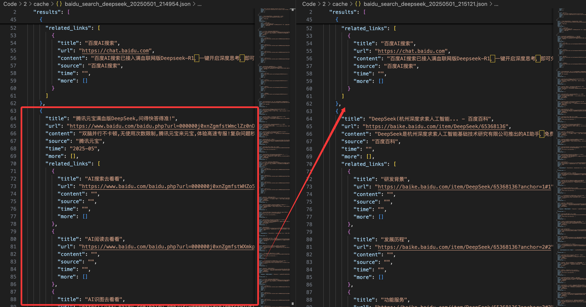
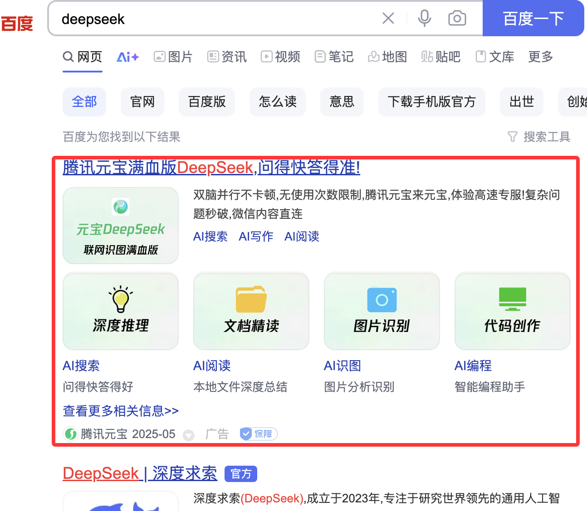
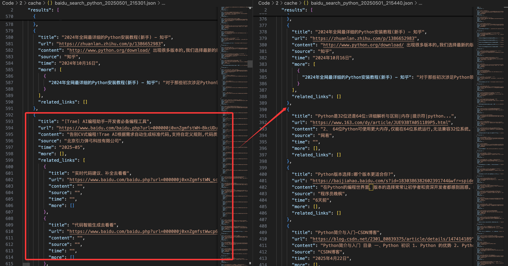
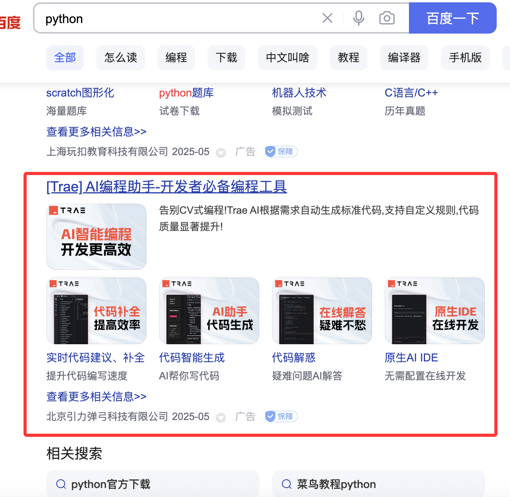
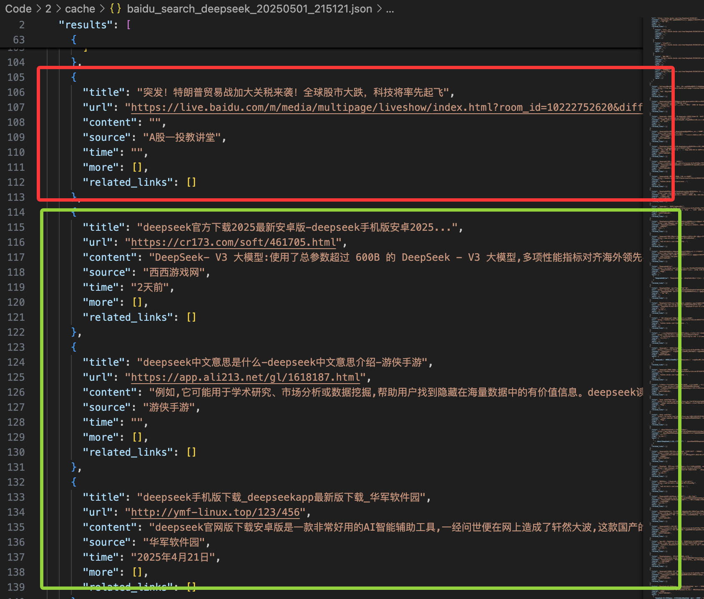
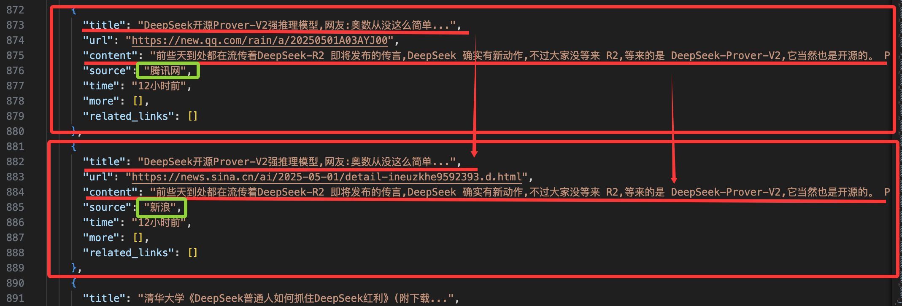

# 实验2 设计百度页面遍历爬取工具

## 实验目的

在实验 1 的基础上进一步优化和扩展 Baidu 搜索结果爬虫, 实现了多页面并发爬取功能, 增强数据去重机制, 以及添加广告过滤功能. 通过这些改进提高爬虫的效率、准确性和数据质量, 为后续基于搜索结果的 DeepSeek 大模型应用提供更完善的数据支持.

## 实验要求

1. 遍历 10 个数据页面
2. 结合实验 1, 抽取数据页面的相关信息, 并记录数据信息
3. 数据存为 `json` 格式文件
    信息: 网页标题、页面链接、网页摘要
    `json` 格式为:

    ```text
    {“title”:”网页标题”, ”link”:”http://XXXXXX”, ”summary”::”网页摘要”},
    {}
    ```

## 实验流程
<!-- 介绍整个实验的操作过程，实验参数设置，实验验证的流程和测试数据 -->

本实验在实验 1 的基础上, 针对多页面爬取效率、数据去重准确性和广告过滤能力进行了系统性优化. 主要新增和改进点如下:

### 多页面并发爬取

实验 1 采用串行方式逐页爬取, 效率较低. 本实验引入异步并发与批处理机制, 显著提升了多页面爬取速度. 核心思路如下:

- 通过 `asyncio` 实现多页面异步请求, 设置最大并发页数 `max_concurrent_pages`, 防止被反爬
- 每批请求后随机延时, 模拟人工行为, 降低反爬风险

```py
# BaiduScraper.scrape (节选)
for i in range(0, num_pages, self.max_concurrent_pages):
    batch_pages = range(i, min(i + self.max_concurrent_pages, num_pages))
    tasks = [
        self.scrape_single_page(session, query, page)
        for page in batch_pages
    ]
    page_batch_results = await asyncio.gather(
        *tasks,
        return_exceptions=True,
    )
    for result in page_batch_results:
        if isinstance(result, list):
            all_results.extend(result)

        # ...异常处理略...

    if batch_pages.stop < num_pages:
        delay = random.uniform(self.min_sleep, self.max_sleep)
        await asyncio.sleep(delay)
```

### 多页面去重与合并优化

实验 1 只需单页去重, 无法处理跨页重复的情况. 实验 2 改进了去重逻辑, 在获取所有页面的结果 (`all_results`) 后进行统一处理.

核心步骤如下:

1. 首先通过 `scrape_single_page` 方法并发爬取所有页面, 将每页的结果存入 `all_results`
2. 在爬取完成后, 对 `all_results` 进行初步去重 (`initial_deduplicate_results`), 减少重复的 `URL`
3. 对初步去重后的结果进行真实链接解析 (`process_real_urls`), 获取最终的目标 `URL`
4. 最后对解析后的结果再次去重 (`final_deduplicate_results`), 确保数据唯一性并合并重复内容

```py
# BaiduScraper.scrape (节选)
all_results = []

async with aiohttp.ClientSession() as session:
    for i in range(0, num_pages, self.max_concurrent_pages):
        batch_pages = range(i, min(i + self.max_concurrent_pages, num_pages))
        tasks = [
            self.scrape_single_page(session, query, page)
            for page in batch_pages
        ]
        page_batch_results = await asyncio.gather(
            *tasks,
            return_exceptions=True,
        )
        for result in page_batch_results:
            if isinstance(result, list):
                all_results.extend(result)

            # ...异常处理略...

        if batch_pages.stop < num_pages:
            delay = random.uniform(self.min_sleep, self.max_sleep)
            await asyncio.sleep(delay)

    # ...
    deduplicated_results = self.initial_deduplicate_results(all_results)
    final_results = await self.process_real_urls(session, deduplicated_results)
```

### 广告过滤功能

实验 1 未处理广告, 实验 2 实现了多维度广告识别与过滤, 提升数据质量. 为了不误删, 不能简单粗暴的检测内容里是否含有 "广告" 等字样, 需要通过属性来判断:

- 检查 style/class/特定标签 等特征 (style 含有 `!important`, class 或标签含有 `tuiguang`), 识别广告内容
- 允许用户配置是否启用广告过滤, 已缓解过滤功能实现不佳造成的影响

```py
# BaiduScraper.is_advertisement
def is_advertisement(self, result):
    style_attr = result.get("style", "")
    if any(keyword in style_attr for keyword in self.AD_STYLE_KEYWORDS):
        return True
    classes = result.get("class", [])
    class_str = " ".join(classes) if classes else ""
    if any(keyword in class_str for keyword in self.AD_CLASS_KEYWORDS):
        return True
    if any(result.select_one(selector) for selector in self.AD_TAG_SELECTORS):
        return True
    return False

# BaiduScraper.parse_results (节选)
for result_container in results:
    if self.filter_ads and self.is_advertisement(result_container):
        continue

    # ...正常解析...
```

通过上述优化, 实验 2 在效率、准确性和数据质量上均有提升, 为后续大模型应用提供了更高质量的数据基础.

### 测试数据

关键词为 "deepseek" 和 "python"，页面数量为 10，分别测试了是否开启广告过滤，以及串行多页面爬取（最大并行数量设为 1）和并行（最大并行数量设为 5），共 8 组爬虫的结果.

## 测试及分析
<!-- 介绍测试结果（包括测试的结果曲线，数据表等），分析实验结果的正确性 -->

### 测试结果

| 关键词 | 广告过滤 | 并发页数 | 总爬取时间 (s) | 结果数 |
|-|-|-|-|-|
| deepseek | N | 1 | 14.33 | 97 |
| deepseek | N | 5 | 3.76 | 95 |
| deepseek | Y | 1 | 13.42 | 85 |
| deepseek | Y | 5 | 4.50 | 85 |
| python | N | 1 | 14.48 | 121 |
| python | N | 5 | 3.81 | 130 |
| python | Y | 1 | 15.07 | 80 |
| python | Y | 5 | 3.75 | 80 |

### 结果分析

#### 性能

可以看出, 并发爬取 (并发数 5) 相比串行模式 (并发数 1), 整体效率提升显著.

#### 广告过滤

可以看出, 在开启广告过滤后, 获得到的有效结果有了减少. 下面展示详细的去除效果:

##### 搜索 deepseek

运行结果


对应浏览器搜索结果


##### 搜索 python

运行结果


对应浏览器搜索结果


可见广告过滤功能是能有效的屏蔽一些广告内容的.

## 实验总结
<!-- 总结实验中出现的问题 -->

在本次实验中, 能较好的以较高的性能并发的完成 Baidu 搜索结果的多页面爬取, 修复了多页面的去重逻辑, 并可以去除部分的广告.

但是, 在实验 1 中出现的内容或信息的误抽取并未解决. 同时, 广告的过滤逻辑较为简单粗暴, 还有其搜索结果还有大量无关, 软广告或者相似抄袭 (或同一内容只是平台不同) 的结果没有处理.

搜索 deepseek, 开启广告过滤. 红为无关内容, 绿为软广


相似抄袭 (或同一内容只是平台不同)


## 实验心得
<!-- 从实验中获得了哪些经验 -->

通过实验深入理解了异步并发编程在爬虫效率提升中的作用, 体会到数据去重和广告过滤对数据质量的重要性. 通过实际编码, 熟悉了 `aiohttp`、`asyncio` 等库的用法, 也认识到网页结构复杂性对信息抽取和广告识别带来的挑战.
